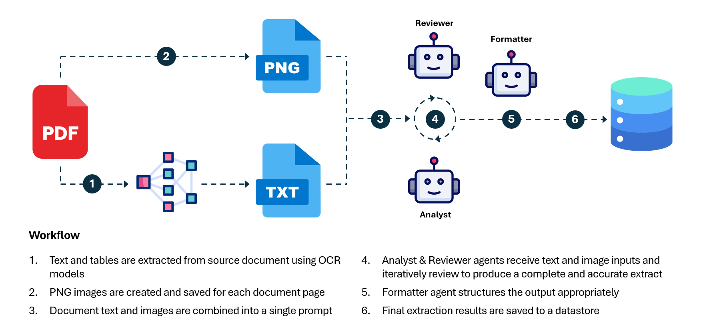

# Complex Document Analysis - Azure AI Agent Service Demo

This sample project contains code for orchestrating multiple agents (built using the Azure AI Agent Service) to extract targeted information from user-provided documents, into a well-defined structure. The agents employed for this task include an Analyst (reviews documents and populates a user-defined template), a Reviewer (reviews and critiques the work of the Analyst), and a Formatter (ensures final extracts adhere to a specific structure with defined data types) It is intended to be used as a generalizable solution that can be adapted and extended to handle automatic analysis of complex documents with the assistance of state-of-the-art LLMs.



Briefly, this repository contains multiple components including:

- Agent Creation Code: A Jupyter notebook to create a set of agents (reviewer, analyst, formatter) in the Azure AI Agent Service for use in complex document analysis. Note: this activity can also be performed manually in the Azure AI Foundry portal.
- Agent Orchestration Code: An Azure Durable Function implementation which coordinates the activities of multiple AI agents to produce a complete and accurate extract of targeted information from a document.
- User Interface: A Streamlit web application which can be used for prompt engineering, testing, and batch processing of documents in bulk. 

## Getting Started

---

### Required Resources

In order to run this code, you will need to deploy the following resources in your Azure environment:

- Azure AI Foundry Project
- Azure OpenAI Model Deployment(s) - recommend using GPT-4o, GPT-4.1, or o4-mini
- Azure Document Intelligence
- Azure Storage Account
- Azure Function App

After provisioning the resources above, create a container within your storage account, note the container name, and upload documents which you wish to analyze.

### Creating Your Agents

To create the AI agents used for this workflow (Analyst, Reviewer, Formatter) you can either 1.) execute the notebook located at [src/setup/agent-creation-notebook.ipynb](src/setup/agent-creation-notebook.ipynb) or 2.) manually create them in an Azure AI Foundry project. If you opt to create these agents manually, you can retrieve the agent instructions from the notebook.

To run the notebook, first create a `.env` file using the template provided in [src/setup/.env.sample](src/setup/.env.sample) which includes the connection string for your Azure AI Foundry connection string.

Following agent creation, collect the agent IDs. These IDs will be used as environment variables in both your Azure Durable Function (agent orchestration) and Streamlit (web UI) code. Note: if running the notebook, these values are automatically stored in your [src/setup/.env](src/setup/.env) file.

### Running Your Agents

The Azure Durable Function code located at [src\api\function_app.py] supports long-running orchestrations and is used to coordinate the agents together to extract targeted information from provided documents, and save the result to a specified datastore.

To run the Azure Function locally you should first configure your local environment using the instructions provided in [this document]().

Then, install the necessary dependencies listed in [src/api/requirements.txt](src/api/requirements.txt) in a virtual environment. Then, create a `local.settings.json` file based on the template at [src/api/sample.settings.json](src/api/sample.settings.json). Briefly, the environment variables represented in this file are as follows:

| Environment Variable                  | Description                                                                                                          |  
|---------------------------------------|----------------------------------------------------------------------------------------------------------------------|  
| `FUNCTIONS_WORKER_RUNTIME`            | Specifies the runtime for Azure Functions. In this case, it is set to `python`.                                      |  
| `AzureWebJobsStorage`                 | Connection string for the Azure Storage account used by Azure Functions.                                             |  
| `STORAGE_CONN_STR`                    | Connection string for another Azure Storage account, potentially used for document analysis storage.                 |  
| `DOC_INTEL_ENDPOINT`                  | Endpoint URL for the Azure Cognitive Services Document Intelligence API.                                             |  
| `DOC_INTEL_KEY`                       | API key for accessing the Azure Cognitive Services Document Intelligence API.                                        |  
| `AZURE_AI_FOUNDRY_CONNECTION_STRING`  | Connection string for Azure AI Foundry, which includes region, subscription ID, resource group, and project name.    |  
| `ANALYST_AGENT_ID`                    | Identifier for the Analyst Agent used in the application.                                                            |  
| `REVIEWER_AGENT_ID`                   | Identifier for the Reviewer Agent used in the application.                                                           |  
| `FORMATTER_AGENT_ID`                  | Identifier for the Formatter Agent used in the application.                                                          |  
| `COSMOS_ENDPOINT`                     | Endpoint URL for the Azure Cosmos DB instance used in the application.                                               |  
| `COSMOS_KEY`                          | Primary key for accessing the Azure Cosmos DB instance.                                                              |  
| `COSMOS_DATABASE`                     | Name of the database in Azure Cosmos DB where documents are analyzed.                                                |  
| `COSMOS_CONTAINER`                    | Name of the container within the Cosmos DB database where analysis results are stored.                               |  

Once you have created the `local.settings.json` file you can run the functions in debug mode using VS Code extensions or via the command line with:

```
cd src\api
func start
```

This should launch your durable function on http://127.0.0.1:7071. You can submit HTTP requests to this local endpoint to execute your agent orchestration.

### Testing Your Agents

To simplify the process of executing your agents, we have provided a sample Streamlit application that can be used for prompt engineering/updating agent instructions, testing individual documents, and analyzing multiple documents in a batch. Before launching the app, install the dependencies listed in [src\app\requirements.txt]. Then, run the following command:

```
cd src\app
python -m streamlit run streamlit_app.py
```

This will launch an application on http://localhost:8501. From here, you can edit the instructions for your Analyst, Reviewer, and Formatter agents (these changes will be synced with the Azure AI Agent Service upon clicking 'Save Prompts'), analyze individual documents stored in your Azure Storage account, or process multiple documents in a batch.